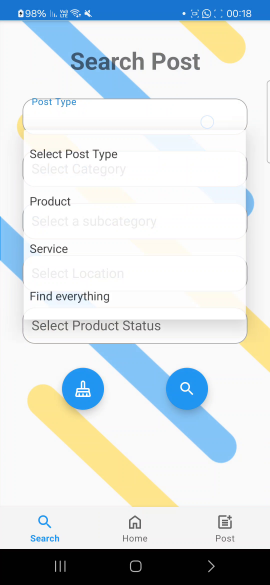

# Helpi

Helpi is an Android application that makes it easy for people in the same area to **offer, request and coordinate help or item exchanges in real‑time**.  
The project was built as part of a university software‑engineering course and already includes chat, geolocation, push notifications and Firebase integration. It comprises ~260 commits and is mostly Java code with a small JavaScript backend for Cloud Functions.

---

## ✨ Overview
* **Community marketplace for help & items** – post ads, browse nearby offers and start a chat with a single tap.  
* **Map‑centric UI** – users pick an exact location when creating a listing, and the home screen shows ads around their current position (Google Maps SDK).  
* **Realtime backend** – Firebase Authentication, Firestore, Storage and Cloud Messaging keep data and notifications in sync across devices.  
* **Cloud Functions micro‑services** – small Node scripts (in `functions/`) handle server‑side validation and scheduled clean‑ups.  

---

##  

---

## 🛠️ Technologies Used

| Layer                      | Tech stack |
| -------------------------- | ---------- |
| **Mobile client**          | Android SDK, **Java**|
| **Backend / Realtime DB**  | Firebase (Auth, Firestore, Storage, FCM) |
| **Serverless logic**       | Firebase Cloud Functions (Node.js) |
| **Build & CI**             | Gradle KTS, GitHub Actions |
| **Design libraries**       | Material Components, Google Maps SDK |

---

## 🚀 Installation
1. **Clone the repo**

   ```bash
   git clone https://github.com/ShayGali/helpi.git
   cd helpi
   ```

2. **Open in Android Studio (Hedgehog 2023.1+ recommended).**  
   The IDE will import the Gradle Kotlin build automatically.

3. **Create a Firebase project** and download `google-services.json` into `app/`.  
   *Enable Email/Google sign‑in and Cloud Messaging in the console.*

4. **Set up local `.env` secrets (optional):**

   ```
   FIREBASE_API_KEY=...
   MAPS_API_KEY=...
   ```

5. **Run on device / emulator**

   ```bash
   ./gradlew installDebug
   adb shell am start -n "com.helpi/.MainActivity"
   ```

---

## 🖥️ Usage

| Feature                | Screenshot |
|------------------------|------------|
| **Browse ads nearby**  |  |
| **Search screen**      |  |
| **Product details**    |  |
| **Home screen**        |  |
| **In-app chat**        |  |


